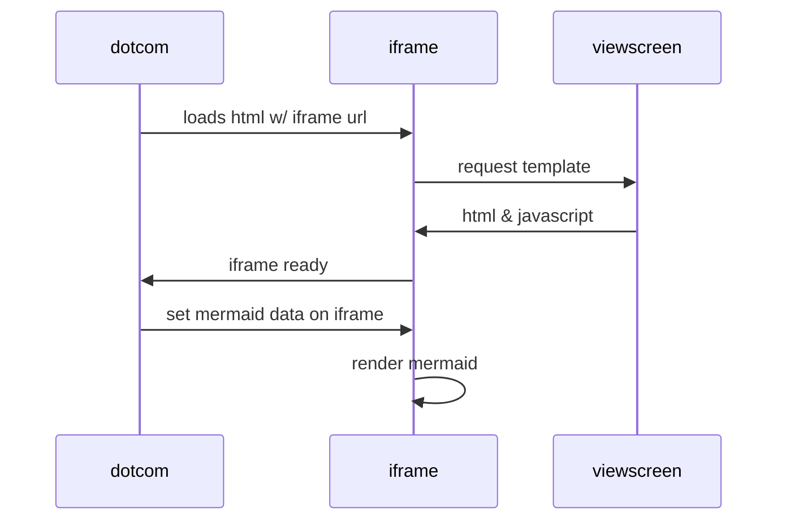

# In the Beginning was the Text File

Hey, look at me! I'm just _plain_ *ol'* text.

Colons can be used to align columns.

| Tables        | Are           | Cool  |
| ------------- |:-------------:| -----:|
| col 3 is      | right-aligned | $1600 |
| col 2 is      | centered      |   $12 |
| zebra stripes | are neat      |    $1 |

[GitHub Flavored Markdown Spec](https://github.github.com/gfm/)
[Markdown Cheatsheet](https://github.com/adam-p/markdown-here/wiki/Markdown-Cheatsheet)

## Proposed Features
- Nuttin' but Markdown
- BORING STUPID SIMPLE. No Frameworks.
- GitHub Pages Compatible
- Push to repo to deploy
- Support local `[[relative/link.md]]` style links
